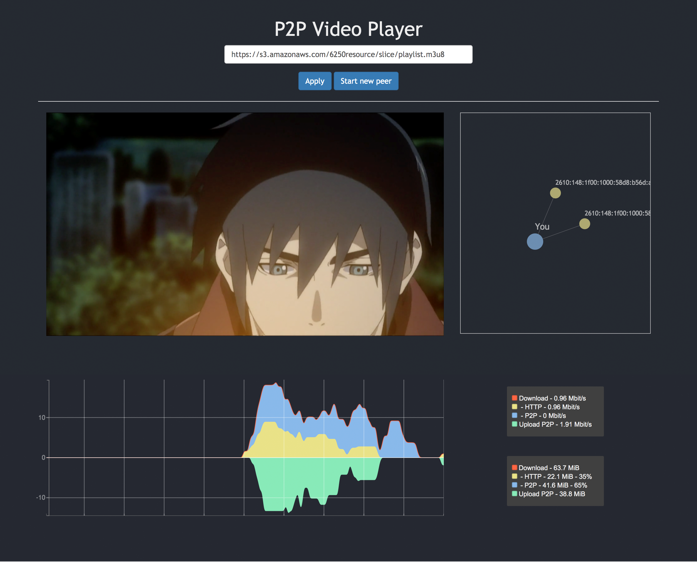

# P2P video streaming system
> This is a simple demo for P2P video streaming system based on p2p-media-torrent, webtorrent and clappr.

## Installation

Just download the files, and open the <code>index.html</code> on the browser.

## Usage example

To simulate the new clients, you can just click "Start new peer" button. After generating new clients, you can see how many new peers are connected to you. Also, the area chart at the bottom will show the upload and download speed both from peer clients or the server.